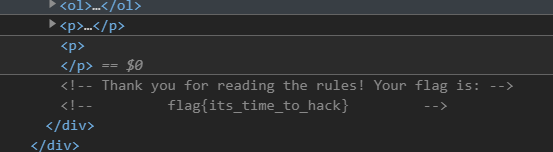
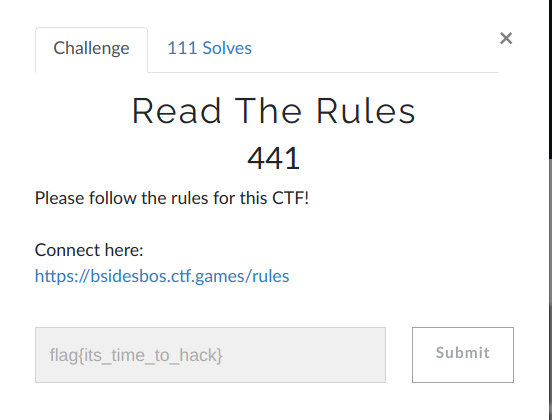
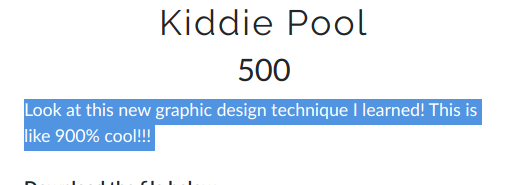
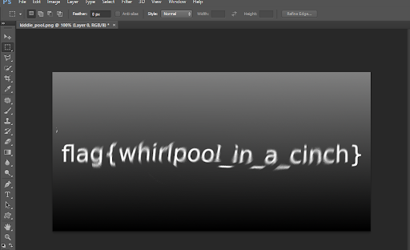

## BSidesBOS CTF

## Read THe Rules

https://bsidesbos.ctf.games/rules

## Kiddie Pool

kiddiepool.png 

Nothing here

 unspiral the image by 900%

Flag Found

## EZ Bake Oven

Coockie in Base64 :

`echo "eyJyZWNpcGUiOiAiRG91Z2hudXRzIiwgInRpbWUiOiAiMDkvMjYvMjAyMCwgMTM6NDQ6MzgifQ==" | base64 -d `
Decoded:

{"recipe": "Doughnuts", "time": "09/26/2020, 13:44:38"}

`echo -n "{"recipe": "Magic Cookies", "time": "08/26/2020, 13:50:21"}" | base64`

eyJyZWNpcGUiOiAiTWFnaWMgQ29va2llcyIsICJ0aW1lIjogIjA4LzI2LzIwMjAsIDE0OjM0OjU3In0K

*New Cookie Value*

document.cookie="eyJyZWNpcGUiOiAiTWFnaWMgQ29va2llcyIsICJ0aW1lIjogIjA4LzI2LzIwMjAsIDE0OjM0OjU3In0K"

## Baseball

TzRaVUNVMlRNRTRIQTZMSFBGWkdTNVpTSzVZVU1ZSllIQk5ER00zREdKTkhBVTJWSkJHVkNWMllPRlVFSzMyRE9GTUVNMkNaR0Y1RU1VUlpNUlNHS1JSWE9CQ1VVU1pZSk4ySEFWVFVPVTJGQzJDV000WlUyUVNHSlpBVFNNUT0=

`echo "TzRaVUNVMlRNRTRIQTZMSFBGWkdTNVpTSzVZVU1ZSllIQk5ER00zREdKTkhBVTJWSkJHVkNWMllPRlVFSzMyRE9GTUVNMkNaR0Y1RU1VUlpNUlNHS1JSWE9CQ1VVU1pZSk4ySEFWVFVPVTJGQzJDV000WlUyUVNHSlpBVFNNUT0=" | base64 -d`

O4ZUCU2TME4HA6LHPFZGS5ZSK5YUMYJYHBNDGM3DGJNHAU2VJBGVCV2YOFUEK32DOFMEM2CZGF5EMURZMRSGKRRXOBCUUSZYJN2HAVTUOU2FC2CWM4ZU2QSGJZATSMQ=

`echo "O4ZUCU2TME4HA6LHPFZGS5ZSK5YUMYJYHBNDGM3DGJNHAU2VJBGVCV2YOFUEK32DOFMEM2CZGF5EMURZMRSGKRRXOBCUUSZYJN2HAVTUOU2FC2CWM4ZU2QSGJZATSMQ=" | base32 -d`

w3ASSa8pygyriw2WqFa88Z33c2ZpSUHMQWXqhEoCqXFhY1zFR9ddeF7pEJK8KtpVtu4QhVg3MBFNA92

## Y2K

`nc challenge.ctf.games 31656`

What year do YOU think the world will end?

20000000000

Yeah! I agree with you! I also think the world will end in the year 

20000000000
 
    If a string is givcen as input

What year do YOU think the world will end?

`asdasd`

Traceback (most recent call last):
  File "/home/challenge/server.py", line 4, in <module>
    end = input()
  File "<string>", line 1, in <module>

NameError: name 'asdasd' is not defined

## Give Up